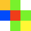
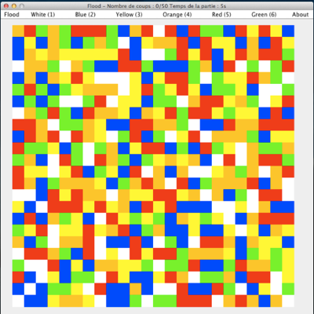
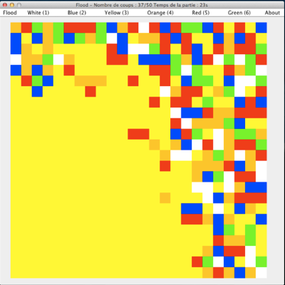

# flood
A reflexion game

##How to play

The goal is simple : fill the matrix with the same color in less than 50 color change. To achieve it you have to flood the matrix by changing color, at first you can only change the color of the lower left corner of the matrix. As you change color, you control each related square to the area you already control. Play with 1,2,3,4,5,6 or via Menu. Press S or space to start.

##Screenshots

##Notes

Builds needs toaster.jar (available on my github) use ant to package toaster.jar into a single .jar

Usable jar is provided in "store" folder. toaster.jar is provided in "dist" folder.

## License

Released under Apache License 2.0
